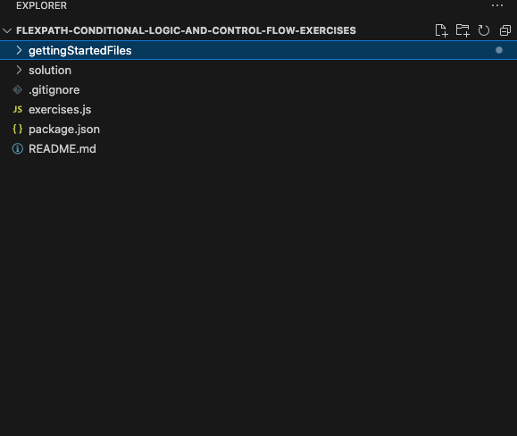
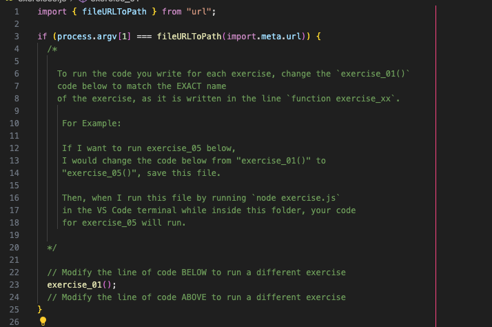

# flexpath-conditional-logic-and-control-flow-exercises

## Exercise overview

The intention of this exercise is to give you more experience working with conditional
logic in JavaScript and controlling program flow.

## Getting Started

1. Using Visual Studio Code, open the folder `flexpath-conditional-logic-and-control-flow-exercises` 
   wherever you saved it on your device. 
2. Your VS code file explorer window should look like this:
   
3. Then open up the `exercises.js` file in the `flexpath-conditional-logic-and-control-flow-exercises` folder. 
   Inside of this file we have provided exercises for you to complete, written 
   in code comments. For each exercise, please code ONLY in the space 
   between the comments `// CODE IN THE OPEN LINES BELOW` and `// CODE IN THE OPEN LINES ABOVE` 
4. To run your code for different exercises, you will update the exercise mentioned
   on line 20 of the file. 
   
5. After changing that line, make sure to SAVE the file before running it.
6. To run your code in exercises.js, you will update line 20 to run the exercise code
   you want to run and save the file. THEN, open a Terminal window in VS Code 
   by going to your toolbar at the top of the page and selecting 
   "Terminal" -> "New Terminal"
7. Inside of this terminal, check that you have Node.js installed by running the 
   command `node -v`. If your computer doesn't recognize that keyword, please
   go back and ensure you installed Node.js correctly.
8. To run `exercises.js` you will then use the command `node exercises.js` in the
   terminal to run the file.

We have included the screen recording from exercise 2 showing how to run these
types of exercise files. 

Exercise solutions are in the `/solution` folder

&nbsp;
---

### Summary of JavaScript Concepts Covered in These Exercises

1. **Conditional Logic**:
    
    - If-else statements for decision-making.
    - Else-if chains and the use of logical operators (`&&` and `||`).
    - The ternary operator for concise conditional expressions.
    - Switch statements for multiple-case conditions and the concept of fallthrough.
2. **Operators**:
    
    - Comparison operators: greater than, less than, equal to, and not equal to.
    - Strict vs. loose equality operators (`===` vs. `==`).
    - Mathematical operators: addition, subtraction, multiplication, division, modulus, and exponentiation.
    - Increment and decrement operators: prefix and postfix usage.
3. **Logical Operators**:
    
    - Logical AND (`&&`) and OR (`||`) for combining conditions.
    - The NOT (`!`) operator for negating Boolean values.
4. **JavaScript Objects**:
    
    - Creating objects with properties and methods.
    - Understanding the differences between primitive values and reference types.
    - Object equality based on memory reference.
5. **Falsy and Truthy Values**:
    
    - Understanding which values evaluate to false in a Boolean context.
    - The importance of falsy values in conditional checks.
6. **Memory Management**:
    
    - How JavaScript handles memory for primitive values and objects.
    - The concepts of the stack and the heap.